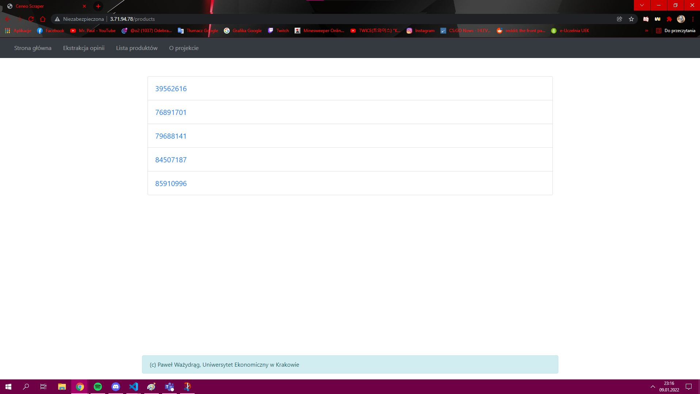

# Automatyczna instalacja aplikacji + serwera proxy
## Zadania związane z instalacją aplikacji
- Zainstalowanie python3, python3-pip, oraz git
- Pobranie repozytorium zawierającego aplikację
- Utworzenie użytkownika
- Nadanie uprawnienień użytkownikowi
- Utworzenie wirtualnego środowiska venv
- Skopiowanie pliku konfiguracyjnego do systemd
- Uruchomienie usługi
## Zadania związane z serwerem proxy
- Zainstalowanie EPEL
- Zainstalowanie nginx
- Skopiowanie pliku konfiguracyjnego "lb.conf"
- Przeładowanie usługi
## Infrastruktura sieciowa
- Adresy IP aplikacji:
    - 18.185.111.18
    - 3.123.142.7
- Adres IP serwera proxy:
    - 3.71.94.78
## Screen aplikacji
