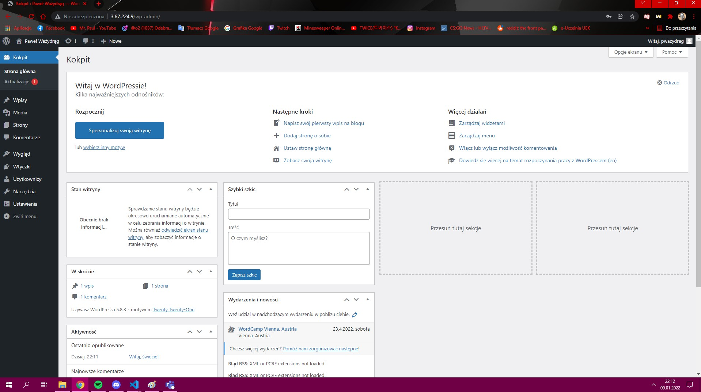

# Automatyczna instalacja Wordpress
## Zadania związane z bazą danych
- Utworzenie folderu blog
- Skopiowanie repozytorium bazy danych MariaDB
- Zainstalowanie MariaDB, a dokładnie: 
    - MariaDB-server
    - MariaDB-client
- Uruchomienie MariaDB
- Zainstalowanie MySQL-python
- Utworzenie bazy danych dla wordpress
- Dodane danych użytkownika oraz nadanie uprawnień
## Zadania związane z systemem
- Zainstalowanie serwera http
- Zainstalowanie EPEL
- Skopiowanie repozytorium PHP
- Zainstalowanie PHP, a dokładnie:
    - php80-php
    - php80
    - php80-php-mysqlnd
    - php80-php-pecl-mysql
## Zadania związane z Wordpress
- Pobranie i wypakowanie Wordpress
- Skopiowanie pliku konfiguracyjnego "blog-vhost.conf"
- Skopiowanie pliku konfiguracyjnego "wp-config.php"
- Przeładowanie apache
## Screen zainstalowanego Wordpressa
